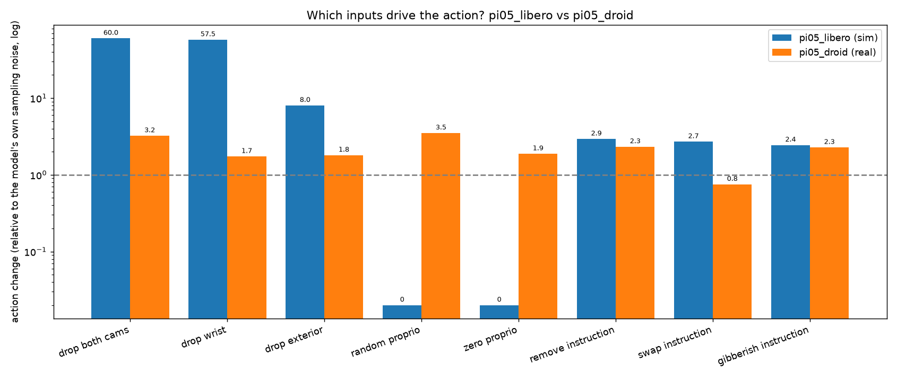
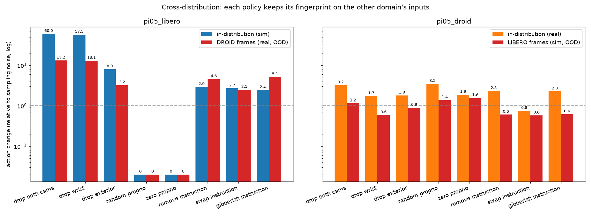
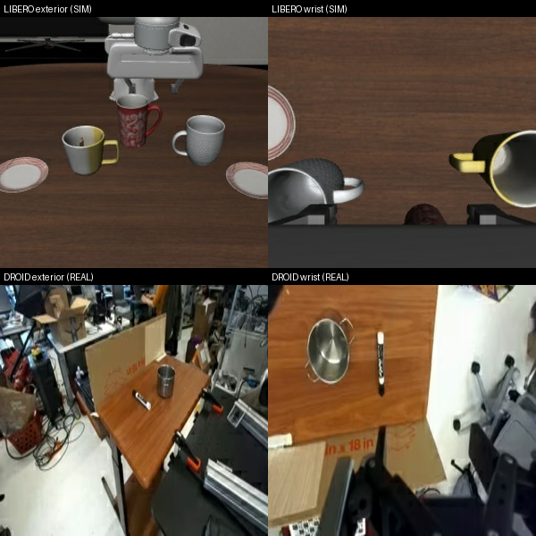

# vla-attribution

A small probe that measures which inputs a VLA policy uses to decide its next action.

VLA policies take several inputs, like camera
views, the robot's proprioceptive state, and a language instruction. From these, it emits an action. Which of those inputs the policy *relies on* is not visible from the loss curve or the benchmark score. This tool investigates that, on any
[openpi](https://github.com/Physical-Intelligence/openpi) checkpoint, in a few
minutes on a single GPU.

## Method

For a trained policy and a bundle of observations:

1. Run the policy on each observation to get a baseline action chunk. The π0.5
   action head is a stochastic flow-matching sampler, so each observation is run
   against a fixed bank of noise draws.
2. Perturb one input at a time. Blank a camera, zero or randomize the
   proprioceptive state, swap/remove/scramble the instruction, and run again on
   the same noise draws.
3. Report the resulting change in the predicted action, **paired** on the noise
   draw (so the only thing that varies is the input) and normalized by the
   policy's own sampling spread.

The unit is "how far the action moves relative to the model re-sampling its own
head." A value near **1** means the input barely matters (indistinguishable from
sampling noise); a **large** value means the policy leans heavily on it; **0**
means it is ignored.

## Experiments on π0.5

Run on Physical Intelligence's two released π0.5 checkpoints, with frames
from each one's matching dataset (LIBERO is a sim; DROID is real
teleop data), with two scenes each.



| perturbation | pi05_libero (sim) | pi05_droid (real) |
| --- | ---: | ---: |
| drop both cameras | 60× | 3.2× |
| drop wrist camera | 57× | 1.7× |
| drop exterior camera | 8.0× | 1.8× |
| random proprioception | 0.00× | 3.5× ¹ |
| zero proprioception | 0.00× | 1.9× ¹ |
| remove instruction | 2.9× | 2.3× |
| swap instruction | 2.7× | 0.75× |
| gibberish instruction | 2.4× | 2.3× |

The two policies depend on seemingly
different components:

- **pi05_libero indexes on its wrist-camera.** The
  wrist view carries almost all of the signal (dropping it ≈ dropping both
  cameras), the exterior view adds little.
- **pi05_droid spreads its reliance.** No single input dominates; it uses
  proprioception and degrades gracefully when one camera is removed.
- **Both policies barely condition on instruction.** Swapping the task for a different real one moves the action about as much as sampling noise.

### The behavior is in the weights, not the input distribution

Feeding each policy the *other* domain's frames keeps each observed behavior too:



| | LIBERO in-sim | LIBERO on DROID | DROID in-real | DROID on LIBERO |
| --- | ---: | ---: | ---: | ---: |
| drop wrist | 57× | 13× | 1.7× | 0.6× |
| drop exterior | 8× | 3.2× | 1.8× | 0.9× |
| zero proprioception | 0.00× | 0.00× | 1.9× | 1.6× |
| random proprioception | 0.00× | 0.00× | 3.5× | 1.4× |
| sampling-noise floor | 0.023 | 0.137 | 0.075 | 0.162 |

On real out-of-distribution frames, pi05_libero still over-weights the wrist. Its state-blindness is
structural, not a property of clean sim images. With no fallback, it just becomes
erratic (its sampling-noise floor rises 6×). pi05_droid does the opposite: on
unfamiliar sim frames it leans *more* on proprioception and trusts the cameras
less, which is in practice graceful degradation under a distribution shift.



## Why this is useful

It can catch shortcuts/overfitting in robot evals. In my experiment, the LIBERO policy acing a benchmark using one camera is overstating real-world competence. In practice, the probe quantifies which sensors a checkpoint indexes on. Strong policies amortize usage to several modalities.

## Setup

Local environment (data prep and plotting):

```bash
pip install -r requirements.txt
```

Inference runs on a cloud GPU via [Modal](https://modal.com).

```bash
modal setup
```

## Usage

```bash
# build an observation bundle from real frames
python prepare_libero.py --episode 0 --out data/libero_ep0.npz
python prepare_droid.py  --episode 0 --out data/droid_ep0.npz

# run the attribution sweep on a GPU
modal run probe.py --bundle data/libero_ep0.npz   # -> data/libero_ep0_attribution.npz

# regenerate the figures from results/runs
python figures.py
```

To attribute a different policy, point a bundle's `config_name` and `checkpoint`
at any openpi config and checkpoint.


## Layout

```
probe.py            Modal app: run the sweep on a GPU
worker.py           attribution logic (runs in the openpi environment)
prepare_libero.py   build a LIBERO observation bundle from HuggingFace
prepare_droid.py    build a DROID observation bundle from HuggingFace
figures.py          regenerate the figures from results/runs
results/runs/       precomputed attribution outputs
results/figures/    generated figures
```
